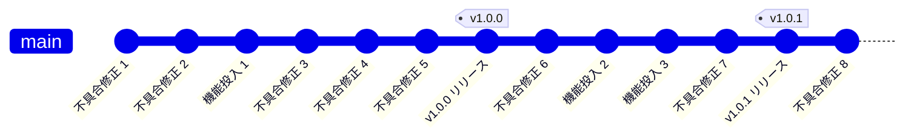
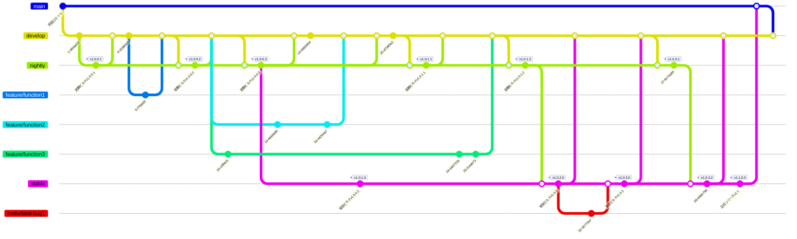

# シーケンシャルなバージョン管理

```mermaid
gitGraph
   commit id: "不具合修正 1"
   commit id: "不具合修正 2"
   commit id: "機能投入 1"
   commit id: "不具合修正 3"
   commit id: "不具合修正 4"
   commit id: "不具合修正 5"
   commit id: "v1.0.0 リリース" tag: "v1.0.0"
   commit id: "不具合修正 6"
   commit id: "機能投入 2"
   commit id: "機能投入 3"
   commit id: "不具合修正 7"
   commit id: "v1.0.1 リリース" tag: "v1.0.1"
   commit id: "不具合修正 8"

```

# 定期ビルドと安定ビルド

```mermaid
gitGraph
  commit id: "初回コミット"

  branch develop
  checkout develop
  commit

  branch nightly
  commit tag: "v1.0.0.1" id: "定期ビルドv1.0.0.1"
  checkout develop
  merge nightly
  commit

  branch feature/function1
  commit
  checkout develop
  merge feature/function1

  checkout nightly
  merge develop
  commit tag: "v1.0.0.2" id: "定期ビルドv1.0.0.2"

  checkout develop
  merge nightly

  branch feature/function2
  branch feature/function3
  commit

  checkout nightly
  merge develop
  commit tag: "v1.0.0.3" id: "定期ビルドv1.0.0.3"

  checkout feature/function2
  commit

  checkout develop
  merge nightly
  commit

  checkout feature/function2
  commit
  checkout develop
  merge feature/function2

  checkout nightly
  branch stable
  commit tag: "v1.0.1.0" id: "安定ビルドv1.0.0.2"

  checkout develop
  merge nightly
  commit

  checkout nightly
  merge develop
  commit tag: "v1.0.1.1" id: "定期ビルドv1.0.1.1"

  checkout develop
  merge nightly

  checkout feature/function3
  commit
  commit
  checkout develop
  merge feature/function3

  checkout nightly
  merge develop
  commit tag: "v1.0.1.2" id: "定期ビルドv1.0.1.2"

  checkout stable
  merge nightly
  commit tag: "v1.0.2.0" id: "安定ビルドv1.0.2"

  checkout develop
  merge stable

  checkout stable
  branch hotfix/fatal-bug1
  commit

  checkout stable
  merge hotfix/fatal-bug1
  commit tag: "v1.0.3.0" id: "安定ビルドv1.0.3"

  checkout develop
  merge stable

  checkout nightly
  merge develop
  commit tag: "v1.0.3.1"

  checkout stable
  merge nightly
  commit tag: "v1.0.3.2"

  checkout develop
  merge stable

  checkout stable
  commit tag: "v1.1.0.0" id: "正式リリースv1.1"

  checkout main
  merge stable

  checkout develop
  merge main
```

